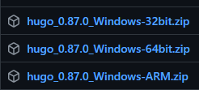
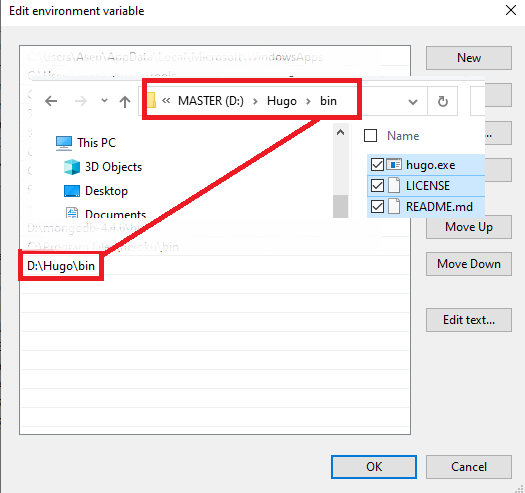
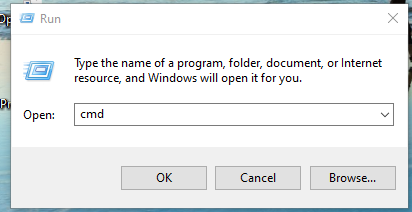
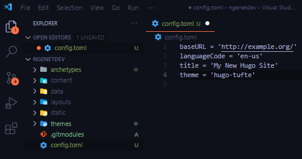

+++
title = "Membuat Situs Web Statis dengan Hugo"
date = 2021-08-05T14:59:17+07:00
toc = true
author = "Asep Sonjaya"
comment = true
tags = [
    "hugo",    
]
categories = [
    "hugo",
    "hugo",
]
series = ["Hugo ROCKS"]
+++

**Hugo** adalah "generator" yang bisa membuat **[Situs Web](https://id.wikipedia.org/w/index.php?title=Situs_web)** Statis secara cepat dan modern, **Hugo** sendiri ditulis dalam bahasa **GO** dan dirancang agar pembuatan situs web bisa menjadi lebih mudah dan menyenangkan. gak lieur mikirin html, css, javascript kecuali kalau mau custom.

Sebenarnya banyak sekali cara untuk menginstal **Hugo** tergantung sistem operasinya, silahkan liat disini [https://gohugo.io/getting-started/installing/](https://gohugo.io/getting-started/installing/)

## Memasang / Instalasi Hugo (Windows)

- [File Binar](https://github.com/gohugoio/hugo/releases)i
- [Chocolatey](https://chocolatey.org/)

### Memasang Hugo menggunakan File Binari

Instalasi Binary mungkin merupakan cara termudah untuk menginstal **Hugo CLI** di komputer Anda. Anda dapat mengunduh versi yang sesuai untuk platform Anda dari [**Hugo Releases**](https://github.com/gohugoio/hugo/releases)

- Saya menggunakan windows 64 bit, jadi saya download hugo_0.87.0_Windows-64bit.zip

    

- Setelah diunduh, Anda perlu meng-unzip ke lokasi sesuai keinginan Anda. File Biner dapat dijalankan dari mana saja, jadi Anda tidak perlu menginstalnya di lokasi global, tapi sangat disarankan untuk melakukan konfigurasi tambahan ke `PATH` untuk memudahkan penggunaan.
- Untuk pengguna windows bisa setting environment variables di user variable / system variable sesuai dengan lokasi **Hugo** yang sudah di ekstrak.

    

- Buka power shell / command prompt / terminal windows apa saja.

    > Windows + R → ketik cmd → Enter

    

- Untuk cek **Hugo CLI** sudah terinstall bisa menggunakan command `hugo version` / `hugo help`

    ```bash
    C:\Users\ngenetdev> hugo version
    hugo v0.87.0-B0C541E4 windows/amd64 BuildDate=2021-08-03T10:57:28Z VendorInfo=gohugoio
    C:\Users\ngenetdev> hugo help
    hugo is the main command, used to build your Hugo site.

    Hugo is a Fast and Flexible Static Site Generator
    built with love by spf13 and friends in Go.

    Complete documentation is available at http://gohugo.io/.

    Usage:
      hugo [flags]
      hugo [command]
    .....
    ```

    Jika muncul seperti ini 

    ```bash
    C:\Users\ngenetdev> hugo version
    'hugo' is not recognized as an internal or external command,
    operable program or batch file.
    ```

    Anda belum melakukan setting konfigurasi Hugo di path environment dengan benar, tapi bisa langsung masuk directory hugo anda dengan perintah seperti ini

    ```bash
    C:\Users\ngenetdev>cd D:\Hugo\bin
    D:\Hugo\bin\>hugo version
    hugo v0.87.0-B0C541E4 windows/amd64 BuildDate=2021-08-03T10:57:28Z VendorInfo=gohugoio
    ```

## Membuat Website dengan Hugo

Untuk membuat Situs Web Statis, bisa menggunakan hugo cli **`hugo new site [lokasi folder]`**

```powershell
PS D:\Hugo\bin> .\hugo new site ngenetdev
atau jika sudah disetting environment cukup masuk directory nya kemudian bisa
menggunakan CLI Hugo
PS D:\WebsiteHugo> hugo new site ngenetdev
atau
PS D:\Hugo\bin> .\hugo new site D:\WebsiteHugo\ngenetdev
untuk lokasi file yang ada spasi pastikan menggunakan "".
Contoh: 
PS D:\Hugo\bin> .\hugo new site "D:\Website Hugo\" jika ada spasi di folder nya (Tidak disarankan)
Catatan:
Powershell harus menggunakan ".\" untuk menjalankan aplikasi di directory yang sama sehingga .\hugo
untuk di Command prompt cukup menggunakan hugo new site
D:\Hugo\bin>hugo new site ngenetdev
Congratulations! Your new Hugo site is created in D:\Hugo\bin\ngenetdev.
....
```

## Menambahkan theme

Lihat [https://themes.gohugo.io/](https://themes.gohugo.io/) untuk daftar tema. untuk saat ini saya menggunakan tema [minima](https://themes.gohugo.io/themes/hugo-theme-minima/), [github](https://github.com/mivinci/hugo-theme-minima)

```powershell
cd ngenetdev
git init
git submodule add --depth 1 https://github.com/mivinci/hugo-theme-minima.git themes/minima
atau jika tidak menggunakan git, bisa di unduh filenya kemudian di ekstrak foldernya 
ke folder themes/
```

kemudian add **tema** ke konfigurasi file config.toml

- **command prompt**

    ```powershell
    echo theme = 'minima' >> config.toml
    ```

- **Text Editor**, kemudian edit config.toml

    

## Tambahkan Content

Kita bisa menambahkan content file secara manual (untuk contoh `content/<CATEGORY>/<FILE>.<FORMAT>`, tapi lebih mudah menggunakan perintah `new` sehingga bisa melakukan lebih banyak lagi (seperti menambahkan judul & tanggal):

```powershell
hugo new posts/my-first-post.md
```

Ubah file yang baru saja dibuat jika anda mau, akan terlihat seperti dibawah ini:

```powershell
---
title: "My First Post"
date: 2019-03-26T08:47:11+01:00
draft: true
---
```

> draft tidak akan di deploy; setelah selesai membuat content, ubah header dari artikel menjadi `draft: false`. Untuk Info lebih cek [https://gohugo.io/getting-started/usage/#draft-future-and-expired-content](https://gohugo.io/getting-started/usage/#draft-future-and-expired-content)

## Memulai Hugo server

Sekarang kita coba hugo server dalam mode `draft:`

```powershell
hugo server -D

D:\Hugo\bin\ngenetdev>hugo server -D
Start building sites …
hugo v0.87.0-B0C541E4 windows/amd64 BuildDate=2021-08-03T10:57:28Z VendorInfo=gohugoio

                   | EN
-------------------+-----
  Pages            |  9
  Paginator pages  |  0
  Non-page files   |  0
  Static files     |  5
  Processed images |  0
  Aliases          |  1
  Sitemaps         |  1
  Cleaned          |  0

Built in 217 ms
Watching for changes in D:\Hugo\bin\ngenetdev\{archetypes,content,data,layouts,static,themes}
Watching for config changes in D:\Hugo\bin\ngenetdev\config.toml
Environment: "development"
Serving pages from memory
Running in Fast Render Mode. For full rebuilds on change: hugo server --disableFastRender
Web Server is available at http://localhost:1313/ (bind address 127.0.0.1)
Press Ctrl+C to stop
```

Buka website di [http://localhost:1313](http://localhost:1313/)

## Sesuaikan tema

Web statisnya sudah bisa dilihat hasilnya, tapi harus ada beberapa konfigrasi yang harus diubah sebelum dirilis secara publik.

Buka `config.toml` menggunakan text editor:

```powershell
baseURL = 'http://ngenet.dev/'
languageCode = 'en-us'
title = 'ngenet.DEV'
theme = 'minima'
```

> untuk tema sendiri biasanya sudah memiliki konfigurasi tambahan seperti menu, parameter tambahan, sebagai contoh kita bisa melihat konfigurasi dari [minima](https://github.com/Mivinci/hugo-theme-minima/blob/main/exampleSite/config.toml)

## Membuat Halaman Situs Web Statis

cukup mudah, menggunakan command:

```powershell
hugo
Contoh: 
D:\Hugo\bin\ngenetdev>hugo
Start building sites …
hugo v0.87.0-B0C541E4 windows/amd64 BuildDate=2021-08-03T10:57:28Z VendorInfo=gohugoio

                   | EN
-------------------+-----
  Pages            |  9
  Paginator pages  |  0
  Non-page files   |  0
  Static files     |  5
  Processed images |  0
  Aliases          |  1
  Sitemaps         |  1
  Cleaned          |  0

Total in 56 ms
```

Hasil website statis akan berada di lokasi `./public` directory secara default (-d/ —destination flag untuk merubah lokasinya, atau tambahkan `publishdir` di config file).

## Konfigurasi Hugo untuk beberapa environments (Opsional)

Project Root folder hugo menyimpan konfigurasi di file `config.toml`. 

```powershell
baseURL = "http://example.org/"
languageCode = "en-us"
title = "My New Hugo Site"
theme = "minima"
```

baseURL digunakan untuk membuat url, misalnya untuk memuat file css. di [localhost](http://localhost) url ini harus kosong, dan di firebase harus menggunakan url project anda (contoh : [https://ngenet-dev.web.app](https://ngenet-dev.web.app/)). 

Untuk membuat lebih dari satu konfigurasi, mari kita buat folder `config`. buat 3 folder dengan nama **`_default`, `development`, dan `production`.** tambahkan file **`config.toml`** di semua folder :

```powershell
config
├── _default
│   └── config.toml
├── development
│   └── config.toml
├── production
│   └── config.toml
└── staging
    └── config.toml
```

- di `_default/config.toml`, tambahkan `languageCode`, `title` dan `theme`
- di `development/config.toml`, tambahkan `baseURL = ""` .
- di `production/config.toml`, tambahkan `baseURL = "[https://ngenet-dev.web.app/](https://ngenet-dev.web.app/)"`**, tapi ganti url dengan url project anda sendiri.

hapus file config.toml dari root project anda.

> Environment bawaan dari hugo sendiri akan mengenali folder **development** ketika menggunakan perintah **`hugo server`** dan folder **production** ketika menggunakan perintah **`hugo`**

Untuk custom environment bisa menggunakan perintah `hugo —environment staging` . Hugo akan menggunakan semua pengaturan dari **`config/_default`** dan menggabungkan dengan `staging` .